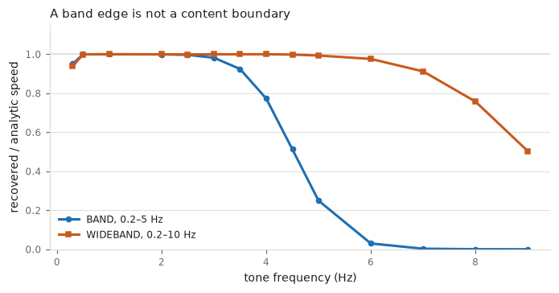

# The four bands

There are four quantity-of-motion conventions here and they are not interchangeable. Reporting
a number without saying which one produced it is the single most common way results in this
field stop being comparable. The four are named in `mm.BANDS` and are passed to `qom` by name,
as `band="micromotion"`, `band="wideband"`, `band="noresp"` or `band="optical_legacy"`.

## `micromotion`—0.2 to 5 Hz

A band-pass, and the package default, exported as `mm.BAND`. It is the only convention that can
be applied to every sensor, so it is the one any cross-collection comparison must use.

### The lower edge is where inertial devices stop agreeing with each other

`BAND` was chosen by a sweep across seven optical datasets, and it serves optical data well. On
INERTIAL data its lower edge is also the point at which different devices stop measuring the same
quantity, which is a separate fact and a sharper one.

Measured on four accelerometers mounted in one stack on one chest — so the body, the moment and the
placement are all held fixed — against optical markers on the stack itself:

| lower edge | spread across the four devices |
|---|---|
| 0.2 Hz | 9.2x (from 3.6 to 32.6 times the optical truth) |
| 0.5 Hz | 1.2x (from 1.9 to 2.3) |

Almost the whole disagreement between devices lives below 0.5 Hz. Quantity of motion integrates
acceleration and integration divides by frequency, so a device that misbehaves only at 0.3 Hz
misbehaves badly. The worst of the four carried 62 times another's power at 0.2–0.5 Hz and 0.6 times
it at 2–5 Hz — the noisiest device in the band and the quietest above it.

This is not an argument for moving `BAND`. It is an argument for STATING the lower edge beside any
inertial figure, and for expecting cross-device comparisons at 0.2 Hz to be dominated by whichever
device drifts most.

## `noresp`—0.45 to 5 Hz

Exported as `mm.NORESP_BAND`: the canonical band with its lower edge raised above respiration.

On a chest-worn sensor the 0.15–0.45 Hz stretch that `BAND` keeps is dominated by respiratory
chest tilt. The ribcage turns the sensor as it expands, so what the accelerometer reads there is
gravity re-projected between axes — a rotation, not the sensor travelling. Measured across the
year-long chest-phone record, 94 to 99 per cent of the power in that band lies perpendicular to
that day's gravity vector, implying a tilt of 0.05 to 0.14 degrees. So a `BAND` value from a
chest sensor carries a respiratory term inside every number, and a `noresp` value does not.

**The choice between the two is a purpose decision, not a correctness one.** For a
cardiorespiratory torso measure, and for any comparison with the rest of the corpus, use `BAND`:
the respiratory term is part of what is being measured, and it is the band everything else was
computed at. For micromotion above respiration — a postural question asked of a chest-worn
sensor — use `noresp`, and say so. The StillStanding365 record deposits both, as `qom_mm_s` and
`qom_045_5hz_mm_s`, each with its band stated, which is the practice to copy.

It is not the `compensated` variant, which raises the edge further, to 0.5 Hz, and also notches
the recording's own cardiac peak. `noresp` changes the band and nothing else; the
ballistocardiac impulse is still inside it.

## `optical_legacy`—10 Hz low-pass, no lower edge

Exported as `mm.OPTICAL_LEGACY_BAND`, which is `(None, 10.0)`. It retains sub-0.2 Hz postural
drift. For optical position that drift is real movement, and this is the convention behind most
published standstill figures. Every band-limiting entry point accepts `lo=None` for it.

**A value computed here is not comparable with one at `BAND`, and the gap is large.** On one
corpus, moving the lower edge from 0.3 Hz to 0.2 Hz alone raised per-marker levels about ten per
cent; removing the lower edge entirely raises them much further, because on an accelerometer
roughly half the velocity power sits below 0.3 Hz. Reporting a legacy-band figure beside a
canonical-band one without saying which is which is the most common way this corpus has produced
an apples-to-oranges comparison. One report quoted a three per cent agreement between two
numbers computed at different bands and called it striking.

## `wideband`—0.2 to 10 Hz

Exported as `mm.WIDEBAND`. It is for jerk and other high-derivative measures that need the
octave the canonical band gives up.

Use it only where `effective_band(fs)` confirms the rate supports it, and never infer the rate
from a file's grid, since a uniform grid may be an upsample of a much slower sensor, and this
corpus contains 364 days where it is. A quantity computed here is not comparable with one
computed at `BAND`, and is not computable at all on the slower collections.

**Check deliverability where the value is produced and again where it is consumed.** A scan that
computes a wideband jerk for every recording regardless of rate, leaving the gate downstream,
will be defeated by the obvious downstream filter: "the value is not null" readmits every
recording the gate was meant to exclude. Carry the measured sensor rate alongside the value and
test against it.

**Deliverability is a property of a channel, not of a collection.** A collection whose deposited
channel cannot carry `WIDEBAND` may have a faster channel on the same device that can, as in
the fusion discussion in [Sampling rates](rates.md). "This collection has no jerk" and "this
channel has no jerk" are different statements, and only the second is usually true.

## A bounded search returns its own boundary

Ask for the largest peak between two frequencies and you will always get an answer, including when
there is no peak between them. What comes back then is a property of the band you drew rather than
of the body you recorded. It does not raise, it is not a NaN, and it is a plausible number that
goes straight into a mean.

**The answer does not have to sit ON the boundary to BE the boundary.** This is the part that keeps
being missed, and it is why the failure survives being found. There are two symptoms and only the
first is obvious:

| symptom | what it looks like | what finds it |
| --- | --- | --- |
| the answer sits on the edge | a column of values all reading exactly 6.0 breaths a minute, or exactly 0.7 Hz | a check for values piled up on an extreme |
| the answer is proportional to the edge | a spread of ordinary-looking values that happen to average 1.3 times the edge, none of them equal to it | moving the edge |

The second is the common one on real data, and every equality check passes it. A spectrum that
falls steeply has no maximum to offer except near the bottom of whatever band you drew, and the
exact bin it lands in depends on the noise, the Welch grid and any filter you applied — so the
values scatter, look like measurements, and move together when the band moves. Put a band-pass over
the same band first and it is worse: the filter's rising skirt reaches inside the passband, so the
largest surviving value sits a fixed fraction above the lower edge instead of on it.

This corpus has now met it five times. The sharpest case is a remote-photoplethysmography pipeline
that band-passed a colour signal between 0.7 and 4 Hz and reported the largest peak inside. Over a
year of daily recordings it returned 1.24 to 1.33 times its own lower edge; sweeping that edge from
0.5 to 1.5 Hz dragged the reported heart rate from 40 to 116 beats a minute; and it never
correlated with a worn reference above 0.21 at any setting. None of its values sat on a boundary.
The diagnostics it shipped with — the peak's height over the band median, the share of power in the
band — predicted nothing, because on a falling spectrum the artefact scores well on both.

### The test is to move the boundary

```python
r = mm.band_edge_sweep(signals, fs, (0.7, 2.2))
r["follows"]     # True: the edge explains the answers better than a rhythm does
r["factor"]      # what multiple of the edge they sit at
r["r_max"]       # the best correlation against a reference, at any edge
```

A genuine rhythm returns the same frequency at every edge below it. An estimate that is the edge
returns `c` times the edge at every edge. `band_edge_sweep` fits both hypotheses and reports which
fits better, so there is no threshold to argue about, and it covers both rows of the table above —
an answer sitting exactly on the edge is the same test with `factor` at 1.0. Pass a whole
collection and a `reference` and the second question follows: if the estimate carries information
about the body, it correlates with an independent measurement of the same quantity at *some* edge.

Two limits, both real. Push the swept edges above the rhythm and every estimator follows them,
correctly, because the rhythm is no longer in the band — so keep the sweep below the frequency you
expect. And the estimator is injectable, called as `estimator(item, fs, (lo, hi))`, precisely
because the pipeline under suspicion is usually not a function in this package.

### What this package's own finders do

Audited on synthetic 1/f series with nothing in a 0.7–2.2 Hz band:

| function | median answer, as a multiple of the lower edge | exactly on the edge |
| --- | --- | --- |
| `mm.spectral_peak` | — (returns NaN) | — |
| `mm.cardiac_peak` | 1.05× | 10 of 40 |
| `mm.dominant_frequency` | 1.07× | 0 of 40 |
| `mm.instantaneous_rate` | 1.00× | 0 of 40 |
| `mm.respiration_rate` | 1.41× | 0 of 40 |

`spectral_peak` is the only one that refuses, and that is what `require_peak` buys: it asks whether
the largest value is a local maximum of the spectrum divided by a log-log line fit across the band,
and returns NaN when it is not. The other four are bare maxima and stay bare maxima, because
published figures came out of them; since 1.12.0 they warn instead, naming the multiple. Note the
bottom row: `respiration_rate` band-passes to the band it then searches, which is the shape that
lands furthest from the edge and is therefore hardest to see.

Note also the third column. Three of the four never land on the edge at all, so an audit that looks
for values piled up on a search boundary — which is what this corpus ran, and what found the first
four instances — would have passed them without a word.

### If you are writing the estimator

State the band beside every rate. Prefer `mm.spectral_peak`, which fails to NaN, and treat the
count of NaNs as part of the result rather than a nuisance; a rate aggregated over many recordings
under this rule is missing its weakest cases, and that is a fact about the aggregate. Where a bare
maximum is what you want, say so with `require_peak=False` and know what you are asking for.

Two repairs that do not work, both tried and measured. Rejecting the edge bin moves the maximum to
the next bin along: on one corpus 662 of 930 values on the edge became 198 of 268 one bin up.
Raising a signal-to-noise threshold selects the artefact rather than excluding it, because the
lowest bin of a falling spectrum has both the most power and the highest power-over-band-median of
anything in a band drawn above the knee — tightening it from nothing to 5 took the share of days
reading exactly the band floor from 21 per cent to 32.

## A share of power needs both its bands named

A "fraction of power in band X" is a ratio of two integrals, and it moves when either band
moves. Four published-looking figures for the share of standstill motion — 38, 43, 45 and 58
per cent — circulated in this corpus and were quoted against one another as though they measured
the same thing. Traced to their origins, each came from a hand-rolled fraction with a different,
sometimes unstated, denominator: the 58 traces only to its own 0.10–3.0 Hz denominator, where
those bands read 59 under the arithmetic below, and the 45 is untraceable to any measurement at
all.

`mm.band_share(x, fs, num_band=..., den_band=...)` is the arithmetic with the bands made
mandatory and keyword-only, so a call site cannot leave either unstated. It raises when the
numerator band reaches outside the denominator, warns when the denominator's upper edge exceeds
what the rate can deliver, and warns on non-finite input. `mm.band_share_from_spectrum` is the
same rule for a spectrum already in hand.

The three-label rule when quoting one: state the domain (power of what quantity), the site
(sensor and placement) and both bands. Acceleration power and position power weight the spectrum
by a factor of frequency to the fourth relative to each other, so a share of one is not even
approximately a share of the other, from the same sensor on the same body.

### And the arithmetic, which is the fourth label

Two bands on one spectrum still do not fix the number, because there are two ways to turn a
Welch spectrum into a band power and this package used both before it said so. The rule is the
quadrature — trapezoid, which weights the two edge bins by a half, or a plain sum of the bins in
the mask, which is the rectangle rule and is what a "bin-summed fraction" means. The closure is
what the edges mean — `[lo, hi]` or `[lo, hi)`. Four combinations, four numbers.

They are not close. Measured on chest-accelerometer standstill recordings, holding the mask fixed
so that only the quadrature rule changed, a respiratory share moved by up to 0.034 absolute on a
share of about 0.16, over a fifth of the value; closure costs a further 0.025 absolute on the same
recordings. Closure costs that much because analysts choose round band edges: at the conventional
60 s window the bins are 1/60 Hz apart, so 0.40, 0.70, 2.20, 3.0, 5.0 and 8.0 Hz all land exactly
on a bin, and closing the interval adds a whole bin at the numerator's upper edge and another at
the denominator's, which do not cancel.

The reason this stayed invisible is that the two agree *exactly* where the band is flat: the
trapezoid's half-weighted end bins remove precisely one bin's worth, so trapezoid-over-`[lo, hi]`
equals bin-sum-over-`[lo, hi)` on flat power. The disagreement is driven by the slope inside the
band, so it is worst at the low end of a red spectrum — the respiratory band, on every body-worn
sensor here.

Which is which, in this package:

| Function | Rule | Closure | Denominator |
| --- | --- | --- | --- |
| `mm.band_power`, `mm.band_power_fraction` | trapezoid | `[lo, hi]` | whole spectrum (`band_power_fraction`) |
| `mm.band_share`, `mm.band_share_from_spectrum` | `integrate=` | `interval=` | named band, mandatory |
| `mm.spectral_band_fractions` | sum | `[lo, hi)` | named band, `physio.DEFAULT_TOTAL_BAND` if unset |

`band_share` defaults to `integrate="trapezoid", interval="closed"`, which is what it and
`band_power` have always computed. `band_share(..., integrate="sum", interval="half_open")`
reproduces `spectral_band_fractions` on the same spectrum to floating point, which is the call to
use when extending numbers computed that way. Neither is more correct; only one of them is the one
your comparison was computed under.

So the label is four things, not three: the domain, the site, both bands, and the arithmetic. In
prose that reads "25 per cent of 0.2–5 Hz raw chest-accelerometer acceleration power lies at
0.8–2.5 Hz, integrated with the trapezoid rule over closed bands", and in a table it is a
`share_convention` column reading `trapezoid/closed` or `sum/half_open`. A share is comparable
only with a share computed the same way.

This corpus holds `trapezoid/closed`, the default above. Four analysis scripts that summed bins
over half-open bands were carried onto it, which republished a chest-phone cardiac share from 58
to 59 per cent, a vest respiration figure from 16.6 to 15.1, a definitional fold from 3.1 to 3.2,
and 18 of the 24 numbers in one decomposition table. That is a re-measurement rather than a
refactor, and it buys one thing: every share in the corpus can now be quoted against every other.

## Where a number should come from

Data, then toolbox, then report, then book. A figure in a paper should trace back through a report
that called this package, to a deposited recording — and at no step should an analysis carry its own
copy of something the package already does.

That is not tidiness. A copied estimator drifts, and the drift is invisible because both versions
run without error. This package exists because a corpus of standstill analyses had, at various
times, one script band-passing at 0.3 to 10 Hz while the rest used 0.2 to 5, another integrating
with a cumulative sum where the rest used a trapezoid, and a third computing a device factor from a
channel nobody else read. Each was defensible alone and wrong in company.

The most expensive instance so far: a report reimplemented resampling with a bare `scipy.signal`
call and published that an optical head marker cannot show the two regions of postural control. It
can, in 619 of 626 recordings. The private copy aliased, the estimator read the shortest lags, and
the conclusion inverted. Nothing errored, and a plausible mechanical explanation grew on top of the
artefact and made it harder to doubt.

So: if this package has a function for it, call it. If the function is wrong, fix it here, where
one fix reaches every analysis — and where a test can hold it.

## Why the lower edge is optional for position and mandatory for acceleration

An optical system measures position directly, so slow drift is a genuine displacement and
keeping it is a choice.

An accelerometer cannot offer that choice. Gravity is a DC term, and integrating a signal with
any residual offset produces a ramp that swamps the result. The package therefore raises on
`band="optical_legacy"` for acceleration rather than return a plausible-looking number.

```python
mm.qom(acc, fs, kind="acceleration", band="optical_legacy")
# ValueError: the 'optical_legacy' band has no lower edge, and an accelerometer
# cannot be integrated without one...
```

## Why 0.2 Hz at the bottom

The lower edge was chosen by measurement rather than by convention. Swept across seven optical
datasets and 665 recordings, the between-dataset spread is:

| lower edge | spread |
|---|---|
| 0.15 Hz | 3.2 % |
| **0.20 Hz** | **2.1 %** |
| 0.25 Hz | 2.7 % |
| 0.30 Hz | 6.2 % |
| 0.40 Hz | 10.1 % |

A clear optimum, and also where the 20 Hz origin dataset stops being an outlier in either
direction.

The edge interacts with the statistic, which is easy to miss. At 0.2 Hz the *median* speed
converges to 2.1 per cent and the mean only to 4.6; at 0.3 Hz it is the other way round. Report
the median at this band. A mean here would be looser than what it replaced.

An edge this close to DC has to be checked against integration drift, since that is the failure
it exists to prevent. It survives: on accelerometer data the mean-to-median speed ratio, which
climbs when drift leaks in, is 2.07 at 0.2 Hz against 2.00 at 0.3, which is flat. The filter
transient does lengthen to 40 seconds at each end rather than 27, so a recording shorter than
about two minutes has no clean interior at all. That rules the band out for short trials; it does
not affect standstill protocols, which run six minutes or more.

## Why 5 Hz at the top

**Because that is what the devices can deliver.** A band above Nyquist is not a convention,
it is a defect that returns a plausible number, and the ceiling has to be one every collection
can support:

| device | sampling | Nyquist | 5 Hz? |
|---|---|---|---|
| phone, fused linear acceleration | ~15 Hz | 7.5 | yes |
| optical, 20 Hz subset | 20 Hz | 10 | yes |
| collaborators' audience data | 10 Hz | 5 | at Nyquist |
| optical and inertial, rest | 100–256 Hz | 50–128 | yes |

A 10 Hz ceiling fails the first row on 354 of 355 days and sits exactly on Nyquist for the
second, where it is silently clamped to 9.9.

The phone case is the instructive one, and it has two layers. Those files are stored on a 100 Hz
grid, which is a six-fold upsample, so nothing above 7.5 Hz in them is real. The reason is not
that the accelerometer is slow, since measured across the year it runs at about 50 Hz. The
deposited channel is *linear acceleration*, which the logging app derives by fusing
accelerometer, gyroscope and magnetometer to remove gravity, and a fusion runs no faster than
its slowest input, which here is the 15 Hz gyroscope. So the constraint is the channel, not the
sensor, and a pipeline built on the raw accelerometer channel would have roughly three times the
bandwidth.

**What the ceiling costs.** Measured over 466 person-recordings from seven collections,
computing both bands from the same array so that only the band differs. The typical recording
barely notices—the median difference is 1.3 per cent, and 95 per cent of quiet-standing sway
power lies below 1 Hz anyway—but this is a distribution, not a bound, and it has a tail:

| collection | median | 90th percentile | maximum |
|---|---|---|---|
| Championships (optical, 100–200 Hz) | 2.83 % | 5.66 % | 9.07 % |
| Taqasim | 1.66 % | 2.67 % | 4.16 % |
| Stillness2025 | 1.11 % | 1.70 % | 2.29 % |
| HpSp | 1.10 % | 3.05 % | 5.32 % |
| Sverm | 0.98 % | 2.93 % | 7.03 % |
| StillStanding365 | 0.61 % | 1.79 % | 2.38 % |
| all | 1.28 % | 3.24 % | 9.07 % |

Nineteen per cent of recordings exceed 2.3 per cent and the largest exceeds it fourfold, so the
median is not a bound. The difference is largest exactly where the ceiling matters most: on the
optical championships the *median* is above 2.3 per cent and 50 of 80 sampled recordings exceed
it, because markers sampled at 100 to 200 Hz genuinely resolve the octave between 5 and 10 Hz,
while a chest accelerometer that never delivered that octave loses nothing by giving it up.

Rankings survive this, since it is a small and fairly uniform shrinkage rather than a
reordering. Quoted absolute levels do not.

**What it costs that matters.** Jerk is two derivatives higher and lives in the octave being
given up: at 5 Hz it is 37 to 66 per cent of its 10 Hz value, and the ranking shifts as well.
Jerk is therefore computed at `WIDEBAND`, on collections fast enough to deliver it, and nowhere
else. On the phone collection the wider jerk was never real, and computing it there inflated the
figure by 18 to 27 per cent with interpolation.

## The nominal edge is not where the filter stops

A band written as 0.2–5 Hz does not pass everything below 5 Hz and reject everything above. It
is a zero-phase fourth-order Butterworth, applied forward and backward, and it is rolling off
well before its nominal corner. Measured on pure tones of known amplitude, recovering the
analytic mean speed:



| tone | canonical `BAND` 0.2–5 Hz | `WIDEBAND` 0.2–10 Hz |
|---|---|---|
| 0.30 Hz | 0.951 | 0.939 |
| 0.50 Hz | 1.000 | 0.999 |
| 1.00 Hz | 1.000 | 1.000 |
| 2.00 Hz | 0.999 | 1.000 |
| 2.50 Hz | 0.997 | 0.999 |
| 3.00 Hz | 0.982 | 1.000 |
| 3.50 Hz | 0.924 | 1.000 |
| 4.00 Hz | 0.773 | 1.000 |
| 4.50 Hz | 0.513 | 0.998 |
| 5.00 Hz | **0.249** | 0.993 |
| 6.00 Hz | 0.030 | 0.976 |
| 7.00 Hz | 0.003 | 0.912 |
| 8.00 Hz | 0.000 | 0.758 |

**Read the 5.00 Hz row.** A pure tone exactly at the canonical ceiling survives at a quarter of
its true amplitude. Full fidelity, better than 99 per cent, extends only to about 2.5 Hz, so the
usable passband is roughly half the nominal upper edge. The same holds at the bottom: 0.3 Hz
already reads 5 per cent low, so content near the 0.2 Hz corner is heavily attenuated rather
than passed.

Three consequences worth keeping in mind.

**Do not read a band edge as a content boundary.** Moving the ceiling from 10 Hz to 5 does not
discard the 5–10 Hz octave; it discards, in effect, everything above roughly 3.5 Hz. That is why
the jerk change is as large as it is.

**Do not probe a filter at its own corner.** A validation test that puts its test tone at the
stated edge will fail against the analytic answer, and the failure is the filter working
correctly. Probe inside the passband and characterise the roll-off separately, as here.

**The steepness is a consequence of zero-phase filtering.** `filtfilt` applies the response
twice, which is what buys zero phase distortion. That matters when the output is going to be
differentiated or integrated, and it costs a sharper effective roll-off than the nominal order
suggests. The trade is deliberate, but the effective bandwidth is narrower than the label.

## The edge is not modality-neutral

The sweep above is over optical datasets, and the accelerometer check above is about drift.
Drift is not the only thing that moves. Holding the pipeline fixed and changing only the lower
edge from 0.3 to 0.2 Hz:

| recorded quantity | change in reported speed |
|---|---|
| position, optical marker | +7 to +18 % |
| acceleration, body-worn | +25 to +94 % |

The asymmetry is structural. Speed comes from *differentiating* position and from *integrating*
acceleration, so the operator converting the recorded quantity to velocity is multiplication by
*f* in one case and division by *f* in the other. Measurement noise is roughly white in whatever
the device records, which means the same sliver of extra low-frequency bandwidth is
suppressed for a marker and amplified for an accelerometer. It is largest on chest-worn sensors,
where 0.2 Hz sits on the respiration fundamental.

What follows:

- **Rankings survive; levels do not.** Where only the band differs, Spearman correlations stay
  at 0.94 and above. Comparisons of who moved more are robust to this. Comparisons of *how many
  millimetres per second* are not.
- **State the band whenever quoting an absolute level from an accelerometer.** The same
  recording supports two defensible numbers a factor of two apart.
- **Treat cross-modality level comparisons as approximate**, however harmonised the band. A
  shared band does not by itself make an optical and an inertial measure interchangeable.

## What the difference costs

Measured on one championship edition, the band-pass reads 15.5 per cent below the low-pass on
identical data.

The choice is not only about matching what is in print. Across seven independent optical
datasets, covering two tracking systems, four sampling rates, twelve years and 789 recordings,
the convergence is:

| Convention | Spread across datasets |
|---|---|
| `micromotion` band-pass | 3.5 % (median speed) |
| `optical_legacy` low-pass | 5.9 % |

The low-frequency drift the legacy filter keeps is the part that varies between datasets; the
band-limited part is the part that does not. If an invariant is the claim, the band-pass states
it better, and it is also the only convention under which an accelerometer can confirm it.

## A trap at 20 Hz

The legacy low-pass cannot be computed at 20 Hz. Its 10 Hz cutoff is Nyquist there, so the
filter has no transition band left. Compute legacy values at the native rate. This also means
any dataset natively recorded at 20 Hz has always had its legacy figures computed at the edge of
what its rate supports.

## These definitions are duplicated inside archival records

Six deposited data records carry a hand-written copy of the band-pass, and some of them of the
fourth-order derivative and the gap-bridging rule as well. That is deliberate: an archival
record has to run for someone who has only that folder, so it may not import this package, and
the definition is written out in numpy and scipy inside the record instead.

The consequence is a fork that nothing keeps in step. Changing `BAND`, `ORDER`,
`NYQUIST_MARGIN`, the interpolation limit or the derivative rule here does not change those
copies, and nothing fails: each record's own check imports its own generator, so the record
stays internally consistent while drifting away from the corpus it belongs to. It is the same
shape as a test holding its own copy of a constant, and it is invisible from either side alone.

A change to any of those constants is therefore a change to seven places, not one. The deposit
tree carries `deposited_vs_toolbox.py`, which runs both implementations on the same synthetic
signals and reports the worst disagreement; run it after touching `filters`, `qom` or
`resample`.

Two conventions differ legitimately between records, and the check reports which each uses
rather than enforcing one. Some pass acceleration in g and some in m/s², and some integrate with
the rectangle rule while others use the trapezoid. The two quadrature rules differ by a fraction
of a per cent—systematic rather than noise—which is why `velocity_from_acceleration` takes
`integrate` rather than choosing for the caller.
