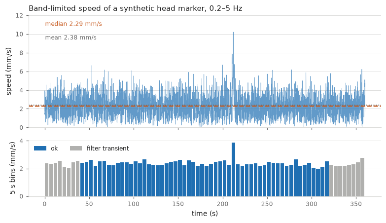
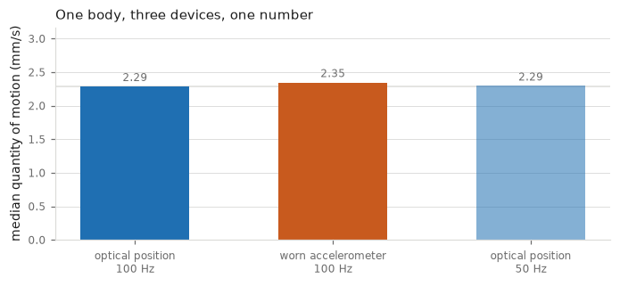

# micromotion

Analysis of human micromotion in motion time series: optical marker data, body-worn
accelerometers, respiration belts and force-plate centre of pressure.

The package is built around one measure, quantity of motion, which is the average speed of a
body part, band-limited to 0.2–5 Hz, in millimetres per second. It applies equally to all of
those sensor families, because the shared abstraction is the frequency band rather than the
device.

```bash
pip install micromotion
```



The figure above is the output of `mm.qom` on a synthetic recording of a standing body, drawn
by `docs/img/make_figures.py`. The dashed line is the median, the dotted line the mean, and the
lower panel shows the same series in five-second bins, with the filter-contaminated ends
flagged rather than dropped.

The claim that the device does not matter is worth seeing rather than taking on trust. Here
is one synthetic body motion read three ways — as optical position at 100 Hz, as the
acceleration a worn sensor would report, and as position sampled at 50 Hz:



2.29, 2.35 and 2.29 mm/s, a spread of 2.6 per cent across a change of sensor family and a
halving of the sampling rate. That agreement is the reason this package exists as one package
rather than three.

What it does NOT mean is that any two real recordings are comparable. These three are derived
from one trajectory, so nothing differs except the pipeline. Real devices also differ in
where they sit on the body, what they are made of and where their noise floor is, and those
differences are large: see [The three bands](conventions.md) and
[Validating data](validation.md).

## Who this is for

Anyone measuring small involuntary movement in a standing, sitting or otherwise stationary
body, whether that is postural sway, physiological tremor, the mechanical trace of breathing
and heartbeat, or how a group of people responds to a shared stimulus. The methods are the
standard nonlinear time-series and posturography ones, and the readers cover common laboratory
formats.

For gait, gesture or dance, this is probably the wrong tool. The band and most of the defaults
assume that the interesting movement is small and that the body is not travelling.

## Why a package

Micromotion analysis has an unusually wide gap between "the method" and "a number". The same
recording will yield materially different answers depending on the filter band, the
differentiation rule, whether the result is band-limited a second time, whether the summary is
a mean or a median, and what the true sampling rate turns out to be. None of those choices
announces itself in a results table.

Each of them is explicit here, each has a measured default rather than an inherited one, and a
few comparisons that look reasonable are refused outright.

## What it will not let you do

- Asking for the legacy optical band on accelerometer data raises an error, because gravity is
  a DC term and an accelerometer cannot be integrated without a lower edge.
- Upsampling raises an error, because it invents structure that scale-sensitive methods treat
  as real.
- Gap sentinels become `NaN` on read. A marker "at the origin", or a centre of pressure at the
  exact middle of a board, are plausible-looking values that are not measurements.
- Partial and filter-contaminated bins are flagged rather than silently included.

## Where to start

| If you want to | Read |
|---|---|
| compute a quantity of motion | [Getting started](quickstart.md) |
| understand a method, or cite it | [Methods](methods.md) |
| know which filter convention to use | [The four bands](conventions.md) |
| compare across datasets or devices | [Sampling rates](rates.md) |
| load a file | [Reading files](formats.md) |
| check data before trusting it | [Validating data](validation.md) |
| reduce a recording to a fixed set of numbers | [One feature vector](features.md) |
| state that an effect is absent | [Stating a null](nulls.md) |
| combine with other toolboxes | [Working with other packages](interop.md) |
| look up a function | [API reference](api.md) |

Practical notes, worked recipes and known traps are on the
[wiki](https://github.com/fourMs/micromotion/wiki), which changes independently of a release.

## Citing

Please cite the package, using `CITATION.cff` in the repository, and cite the underlying
methods as well, since [Methods](methods.md) gives the reference for each.

Licence: GPL-3.0-or-later. Built at the fourMs lab, RITMO Centre for Interdisciplinary Studies
in Rhythm, Time and Motion, University of Oslo.


## Citing

Jensenius, A. R., Upham, F., Zelechowska, A., Gonzalez-Sanchez, V. E., Swarbrick, D., & Riaz, M. (2026). *micromotion: analysis of human micromotion in motion time series* (Version 1.12.2) [Computer software]. Zenodo.
<https://doi.org/10.5281/zenodo.21953120>

That is the CONCEPT DOI and it always resolves to the newest version. Where the exact behaviour
matters, name the version you ran as well: version 1.12.2 is
<https://doi.org/10.5281/zenodo.21953121>. This package has changed behaviour at releases — `read_phone` at 0.15.0, `group_qom` at 1.0.0, `to_rate` at 1.2.2 — so which version produced a number is part of the method.
